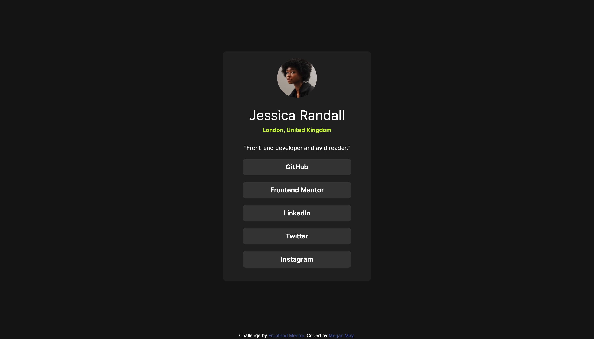

# Frontend Mentor - Social links profile solution

This is a solution to the [Social links profile challenge on Frontend Mentor](https://www.frontendmentor.io/challenges/social-links-profile-UG32l9m6dQ). Frontend Mentor challenges help you improve your coding skills by building realistic projects. 

## Table of contents

- [Overview](#overview)
  - [The challenge](#the-challenge)
  - [Screenshot](#screenshot)
  - [Links](#links)
- [My process](#my-process)
  - [Built with](#built-with)
  - [What I learned](#what-i-learned)
  - [Continued development](#continued-development)
- [Author](#author)

## Overview

### The challenge

Users should be able to:

- See hover and focus states for all interactive elements on the page

### Screenshot

### Links

- Solution URL: [Frontend Mentor](https://www.frontendmentor.io/solutions/responsive-social-links-profile-using-html-css-and-bootstrap-FdQUCQbS_V)
- Live Site URL: [GitHub Pages](https://mooogz.github.io/social-links-profile-main/)

## My process

1. Structured content with HTML
2. Added Bootstrap classes
3. Tweaked CSS to improve responsiveness and active states

### Built with

- Semantic HTML5 markup
- CSS custom properties
- Flexbox
- Mobile-first workflow
- [Bootstrap 5.3](https://getbootstrap.com/) - CSS Framework

### What I learned

I learned about Bootstrap classes that make styling so much faster and more streamlined, notably changing border radiuses and making the rounded image.

### Continued development

I plan to learn more about Bootstrap and implement it in a larger project.

## Author

- Frontend Mentor - [@yourusername](https://www.frontendmentor.io/profile/mooogz)
- X - [@MegzDev](https://www.x.com/MegzDev)
